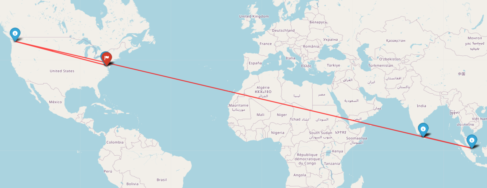

## Traceroute visualizer 🛜🗺️

---

### Concept:
- A visualizing tool that can be used to visualize the path taken by packets when reaching a certain IP address of requirement.
- The hop IP addresses are mapped into their geographical locations and located in an actual map for eas of visualization

---

### Running


- Manually run the following and obtain IP addresses for hops.
  (P.S.: I'm bored at the moment to automate this part😌. If anyone is interested pls contribute 😅)
```bash
Windows
    tracert www.website.com
UNIX env
    traceroute www.website.com
```
- Now enter the IP addresses into input.txt as in the format entered.
```bash
SITE-www.uoregon.edu
 1.|-- 172.28.16.1
 2.|-- 10.147.23.246
 3.|-- 10.30.116.225
 4.|-- 10.1.1.74


```

- The outputs are stored in .html files for each website and will be displayed as follows:


